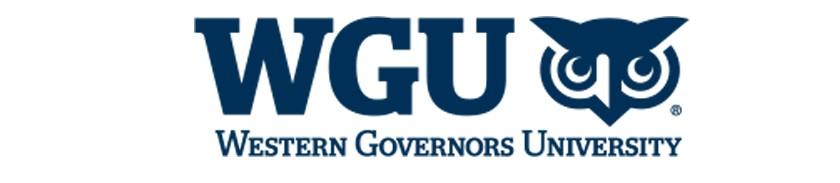

# WGU MSDA

# Data Analytics Capstone Project

As I moved through my classes for Western Governors University (WGU) Masters of Science in Data Analytics (MDSA), two areas of Data Analytics continually fascinated me: data cleaning and Natural Language Processing (NLP). After spending over a decade implementing IT systems the saying, "garbage in garbage out" never rang truer than when creating machine learning models. I could see firsthand how a model with unclean or bad data was executed, and then I could see the marked improvement in the model's performance with clean data. On the other end something about taking words, translating them to numbers, executing a model on those numbers to determine a prediction - something about that entire process just stuck with me.
 
For my capstone project, I desired to create something to incorporate these two elements and landed on: **Sentiment Analysis to Indicate Customer Satisfaction**. Or - how do we take the feedback we've received from customers in written form, determine if that feedback is positive/happy or negative/sad, and then over a large population of this feedback calculate an overall score on how positive/happy or negative/sad our customers view us?

In this repository you will find several documents:

* **[Business Summary](https://github.com/holsteco/WGU_MSDA/blob/main/D214-Capstone/D214_NKM2_Task_3_Submission_Holstege_Business_Summary.pdf)**: If you only want to review one document, please take a look at this one. This is a PDF of a PowerPoint I presented for the capstone submission. This document summarizes at a high level the problem statement and hypothesis, context, data analysis process, an example of a clean review, outline of findings, proposed actions, and expected benefits.

* **[Executive Summary](https://github.com/holsteco/WGU_MSDA/blob/main/D214-Capstone/D214_NKM2_Task_3_PA_Submission_Holstege_Executive_Summary.pdf)**: This PDF has more details than the Business Summary, but not as many as the Full Submission. This goes into slightly more detail on how the data was cleaned and prepared for modeling, how the final model was selected, the execution of the model with never-before-seen data, and the calculation of customer satisfaction.

* **[Full Submission](https://github.com/holsteco/WGU_MSDA/blob/main/D214-Capstone/D214_NKM2_Task_2_PA_Submission_Holstege.pdf)**: If you want to see all the details this is the PDF for you. It has it all to the tune of 86 pages. The research question, where and how the data was collected that is used and explanations of the code and results on how the data was prepared, results from the four models that were executed, selecting the best model, calculating the customer satisfaction score, and summary and implications

* **[Code](https://github.com/holsteco/WGU_MSDA/blob/main/D214-Capstone/D214_NKM2_Submission_Holstege.py)**: This is the full Python code I wrote for this capstone. The code analyzes and then cleans the data, prepares the data for modeling, trains and then tests the neural network, views the results, and calculates the customer satisfaction score.

* **Data files**: These two CSV files are the data files used for this capstone. The larger file was downloaded from Kaggle, as described in various documents above. The smaller file is a subset of reviews I manually scraped from various social media sites to prove the concept.

* **[Capstone Topic Approval Form](https://github.com/holsteco/WGU_MSDA/blob/main/D214-Capstone/MSDA%20Capstone%20Topic%20Approval%20Form_Holstege.pdf)**: Exactly what it sounds like. This is the form I submitted to WGU to obtain approval for this capstone.